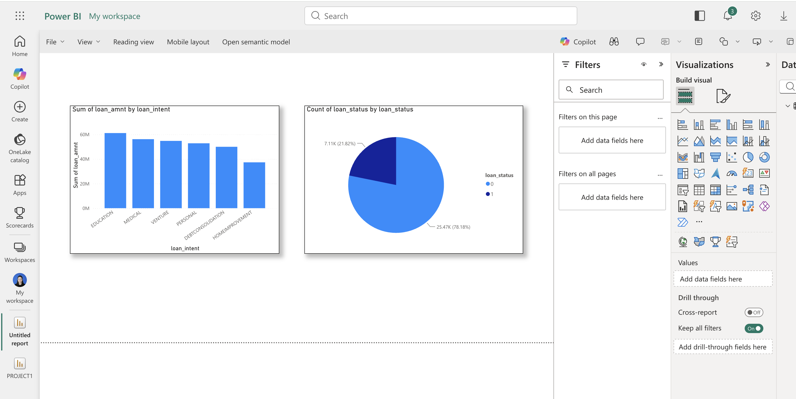

# Credit Risk & Loan Analysis Portfolio

This repository contains a complete end-to-end data analysis project focused on **Credit Risk and Loan Data**. The goal of the project is to clean raw loan application data, analyze credit risk, and build an interactive dashboard to help financial institutions make data-driven lending decisions.

## Project Workflow
1. **Data Cleaning (Python):** Checked and imputed missing values (like `loan_int_rate` and `person_emp_length`) using Pandas, exporting a clean dataset for database storage.
2. **Database Integration & Analysis (SQL):** Imported the cleaned dataset into MySQL to write queries for calculating average income, loan distributions, and interest rates by loan intent.
3. **Data Visualization (Power BI):** Designed an interactive dashboard to visualize credit risk trends, loan amounts, and customer demographics.

---

## 📊 Dashboard Preview
Below is the dashboard snapshot representing key metrics and credit risk insights:



---

## 📂 Repository Structure
* **`analysis.py`**: Python script used to clean the raw credit dataset.
* **`queries.sql`**: SQL scripts used to query and aggregate data inside MySQL.
* **`cleaned_credit_risk.csv`**: The clean version of the dataset ready for MySQL and Power BI.
* **`Credit_Risk_Loan_Analysis.png`**: Screenshot of the Power BI dashboard.

---

## ⚙️ Technologies Used
* **Python** (Pandas) for Data Preprocessing
* **SQL (MySQL)** for Data Management & Queries
* **Power BI** for Business Intelligence & Dashboard Visualization

---

## 🚀 How to Run the Project
1. **Run Python script** to clean the dataset:
   ```bash
   python3 analysis.py
   ```
2. **Import** `cleaned_credit_risk.csv` into your MySQL Database.
3. **Execute** `queries.sql` inside MySQL Workbench to see aggregated metrics.
4. **Open Power BI** and import the database or CSV to explore the dashboard.
